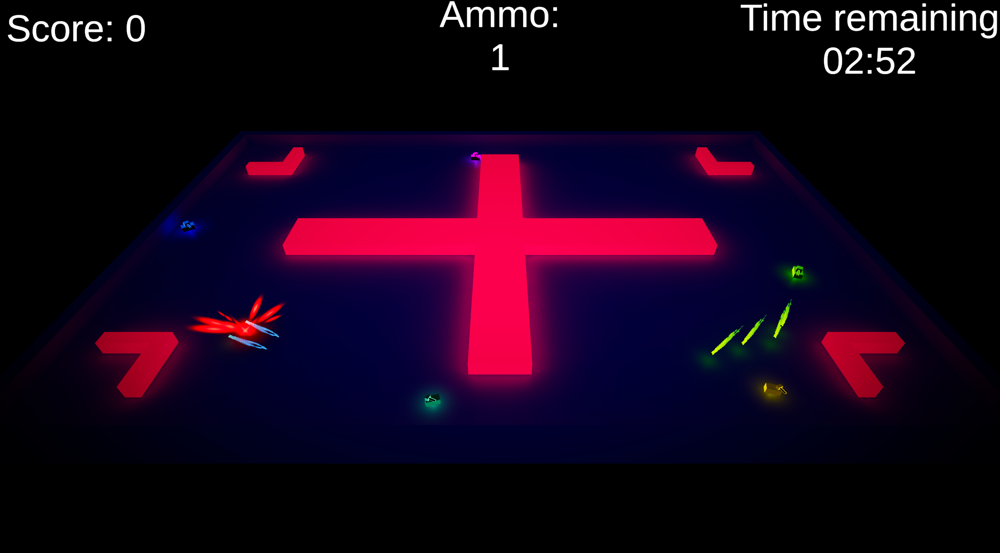

# Top-down multiplayer game

A simple game I'm working on

This project is being made using Unity Engine, using FishNetworking as its multiplayer solution

Currently there are 2 modes, 4 maps, 3 tank types, and 6 player colors to choose from

## Known issues

-  ~~Turrets desync when using client side prediction~~ fixed

- **End screen generates errors**
   - *These errors do not crash the game*

- **Perspective can mess up aim**
    
## To be added:

1. More tank types
2. More colorful maps (all maps currently use the same color palette)
3. Updated tanks models
    + All models are currently very simple, hard to tell apart, and it sometimes is difficult to see where they are aiming
4. Improved ligthning
    + It is looking quite good already, but there are some places where it can improve
5. Peer to peer connections and lobby
    + FishNet must first add support for Unity's Relay and Lobby services
    + For now, the game uses PlayFlow's dedicated servers
6. Cleaner UI

